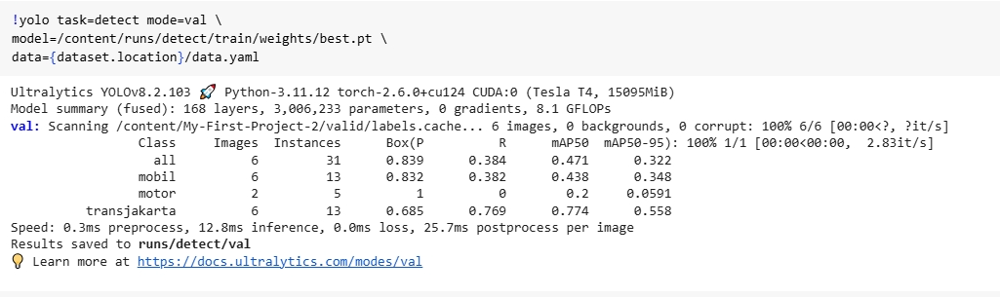
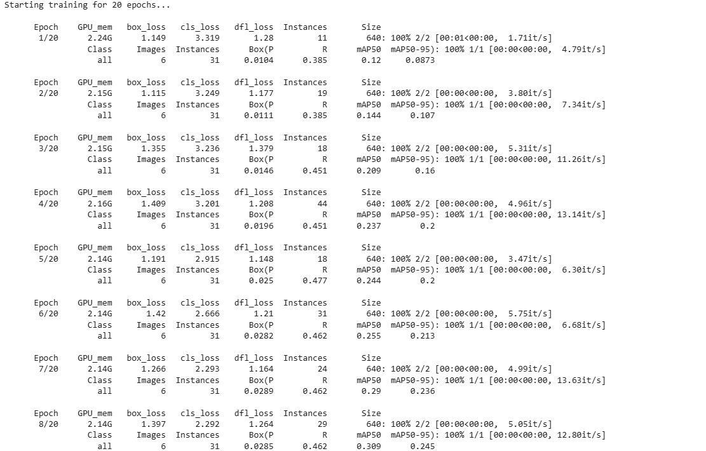
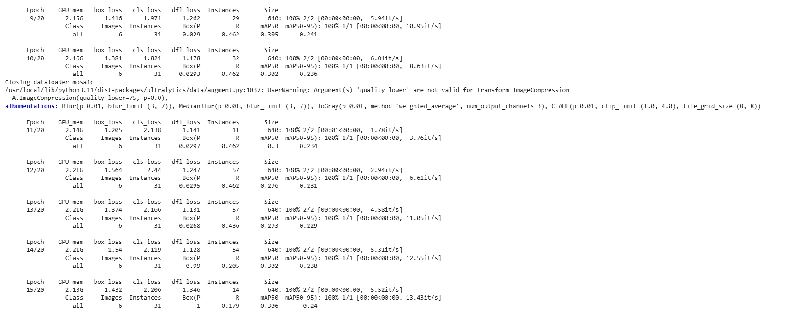
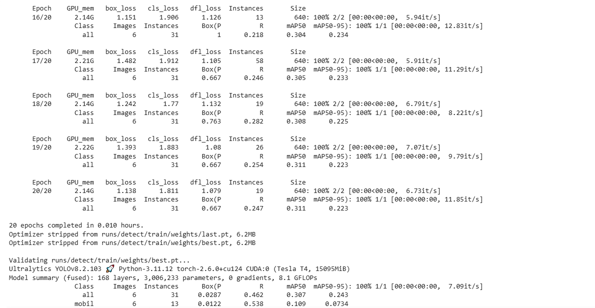

🌱 YOLOv8 Object Detection - Data Labeling Portfolio🌱
Ini adalah proyek portofolio data labeling dan pelatihan model YOLOv8 yang saya kerjakan menggunakan dataset custom untuk mendeteksi objek **Bus Transjakarta**, **Mobil**, dan **Motor**.

Proyek ini mencakup proses:
- Data labeling (annotasi bounding box)
- Setup konfigurasi YOLOv8
- Training dan validasi model
- Inference untuk menguji model

📁 Struktur Folder 
yolov8-labeling-project/

├── [📄 Lihat file data.yaml](./data.yaml)
├── 📂 [Buka folder `train`](./train/) # Data training
├── 📂 [Buka folder `valid`](./valid/) # Data validasi
├── 📂 [Buka folder `test`](./test/) # Data pengujian
├── README.md # Dokumentasi proyek
├── [📄 Lihat file best(2).pt](./best(2).pt) # Model hasil training
├── [📄 Lihat file results.md](./results.md)  # Catatan hasil training/inference

---

## 📦 Dataset

Dataset dibuat dan dilabeli secara manual menggunakan Roboflow, lalu diekspor dalam format YOLOv8. Label terdiri dari beberapa kelas objek relevan dengan kasus nyata.

- Jumlah gambar train: **20**
- Jumlah gambar valid: **6**
- Jumlah kelas: **(otomatis terdeteksi dari `data.yaml`)**

---

> ⚠️ Gambar & label hanya digunakan untuk keperluan edukasi dan demonstrasi portofolio.

---

## ⚙️ Model Training

Model dilatih menggunakan YOLOv8 dari library `ultralytics`.

- Training dilakukan di Google Colab 
- Hasil disimpan di: `yolov8-training/best.pt`

---

## 🔍 Inference & Evaluasi

Confusion matrix

Results

