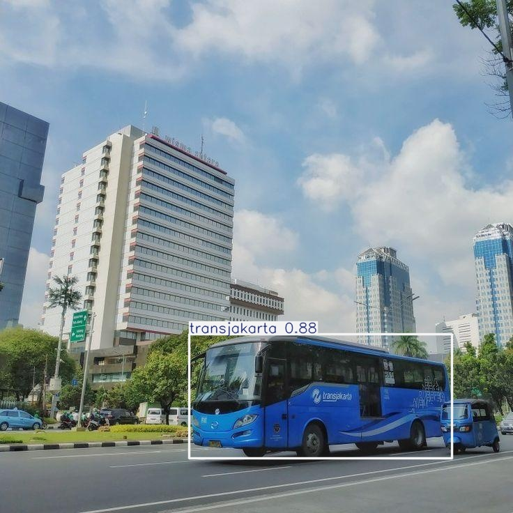
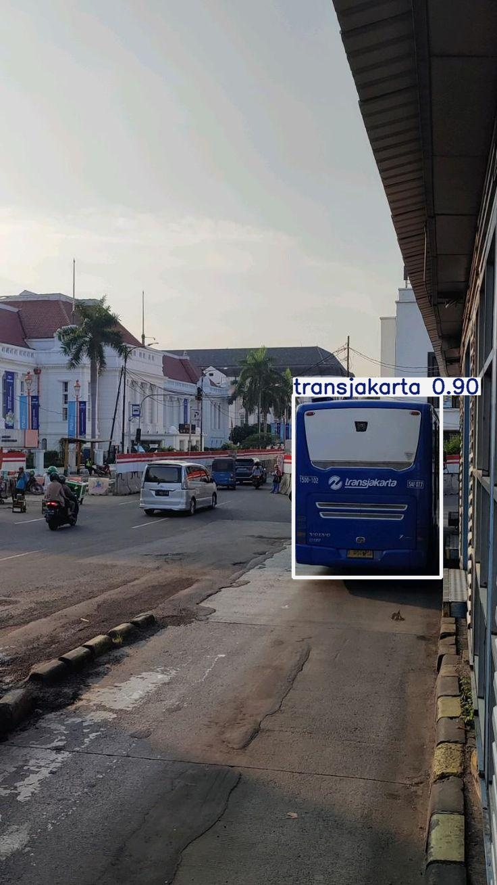
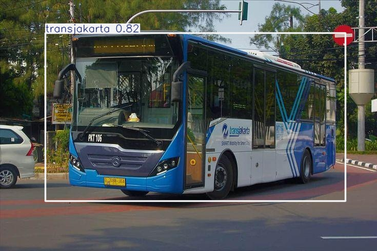
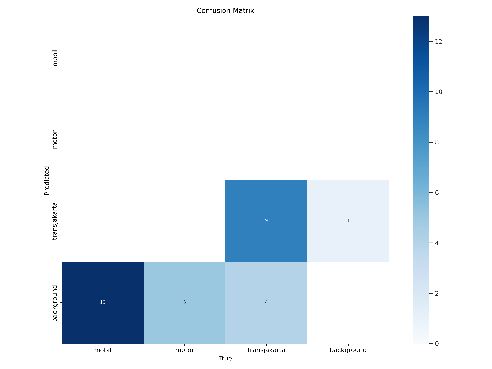
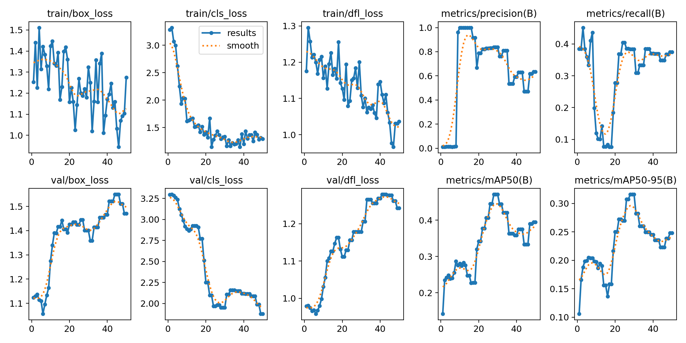

🌱 YOLOv8 Object Detection - Data Labeling Portfolio🌱

Ini adalah proyek portofolio data labeling dan pelatihan model YOLOv8 yang saya kerjakan menggunakan dataset custom untuk mendeteksi objek **Bus Transjakarta**, **Mobil**, dan **Motor**.

Proyek ini mencakup proses:
- Data labeling (annotasi bounding box)
- Setup konfigurasi YOLOv8
- Training dan validasi model
- Inference untuk menguji model

---

📁 Struktur Folder 

yolov8-labeling-project/

├── [📄 Lihat file data.yaml](./data.yaml)
├── 📂 [Buka folder `train`](./train/) # Data training
├── 📂 [Buka folder `valid`](./valid/) # Data validasi
├── 📂 [Buka folder `test`](./test/) # Data pengujian
├── README.md # Dokumentasi proyek
├── [📄 Lihat file best(2).pt](./best(2).pt) # Model hasil training
├── [📄 Lihat file results.md](./results.md)  # Catatan hasil training/inference

---

## 📦 Dataset

Dataset dibuat dan dilabeli secara manual menggunakan Roboflow, lalu diekspor dalam format YOLOv8. Label terdiri dari beberapa kelas objek relevan dengan kasus nyata.

- Jumlah gambar train: **20**
- Jumlah gambar valid: **6**
- Jumlah kelas: **(otomatis terdeteksi dari `data.yaml`)**

---

> ⚠️ Gambar & label hanya digunakan untuk keperluan edukasi dan demonstrasi portofolio.

---

## ⚙️ Model Training

Model dilatih menggunakan YOLOv8 dari library `ultralytics`.

- Training dilakukan di Google Colab 
- Hasil disimpan di: `yolov8-training/best.pt`

---

## 🔍 Inference & Evaluasi

New https://pypi.org/project/ultralytics/8.3.154 available 😃 Update with 'pip install -U ultralytics'
Ultralytics YOLOv8.2.103 🚀 Python-3.11.13 torch-2.6.0+cu124 CUDA:0 (Tesla T4, 15095MiB)
engine/trainer: task=detect, mode=train, model=yolov8n.pt, data=/content/My-First-Project-4/data.yaml, epochs=20, time=None, patience=100, batch=8, imgsz=640, save=True, save_period=-1, cache=False, device=None, workers=8, project=None, name=train, exist_ok=False, pretrained=True, optimizer=auto, verbose=True, seed=0, deterministic=True, single_cls=False, rect=False, cos_lr=False, close_mosaic=10, resume=False, amp=True, fraction=1.0, profile=False, freeze=None, multi_scale=False, overlap_mask=True, mask_ratio=4, dropout=0.0, val=True, split=val, save_json=False, save_hybrid=False, conf=None, iou=0.7, max_det=300, half=False, dnn=False, plots=True, source=None, vid_stride=1, stream_buffer=False, visualize=False, augment=False, agnostic_nms=False, classes=None, retina_masks=False, embed=None, show=False, save_frames=False, save_txt=False, save_conf=False, save_crop=False, show_labels=True, show_conf=True, show_boxes=True, line_width=None, format=torchscript, keras=False, optimize=False, int8=False, dynamic=False, simplify=True, opset=None, workspace=4, nms=False, lr0=0.01, lrf=0.01, momentum=0.937, weight_decay=0.0005, warmup_epochs=3.0, warmup_momentum=0.8, warmup_bias_lr=0.1, box=7.5, cls=0.5, dfl=1.5, pose=12.0, kobj=1.0, label_smoothing=0.0, nbs=64, hsv_h=0.015, hsv_s=0.7, hsv_v=0.4, degrees=0.0, translate=0.1, scale=0.5, shear=0.0, perspective=0.0, flipud=0.0, fliplr=0.5, bgr=0.0, mosaic=1.0, mixup=0.0, copy_paste=0.0, auto_augment=randaugment, erasing=0.4, crop_fraction=1.0, cfg=None, tracker=botsort.yaml, save_dir=runs/detect/train
WARNING: All log messages before absl::InitializeLog() is called are written to STDERR
E0000 00:00:1749825090.969851   29975 cuda_dnn.cc:8310] Unable to register cuDNN factory: Attempting to register factory for plugin cuDNN when one has already been registered
E0000 00:00:1749825090.976455   29975 cuda_blas.cc:1418] Unable to register cuBLAS factory: Attempting to register factory for plugin cuBLAS when one has already been registered
Overriding model.yaml nc=80 with nc=3

                   from  n    params  module                                       arguments                     
  0                  -1  1       464  ultralytics.nn.modules.conv.Conv             [3, 16, 3, 2]                 
  1                  -1  1      4672  ultralytics.nn.modules.conv.Conv             [16, 32, 3, 2]                
  2                  -1  1      7360  ultralytics.nn.modules.block.C2f             [32, 32, 1, True]             
  3                  -1  1     18560  ultralytics.nn.modules.conv.Conv             [32, 64, 3, 2]                
  4                  -1  2     49664  ultralytics.nn.modules.block.C2f             [64, 64, 2, True]             
  5                  -1  1     73984  ultralytics.nn.modules.conv.Conv             [64, 128, 3, 2]               
  6                  -1  2    197632  ultralytics.nn.modules.block.C2f             [128, 128, 2, True]           
  7                  -1  1    295424  ultralytics.nn.modules.conv.Conv             [128, 256, 3, 2]              
  8                  -1  1    460288  ultralytics.nn.modules.block.C2f             [256, 256, 1, True]           
  9                  -1  1    164608  ultralytics.nn.modules.block.SPPF            [256, 256, 5]                 
 10                  -1  1         0  torch.nn.modules.upsampling.Upsample         [None, 2, 'nearest']          
 11             [-1, 6]  1         0  ultralytics.nn.modules.conv.Concat           [1]                           
 12                  -1  1    148224  ultralytics.nn.modules.block.C2f             [384, 128, 1]                 
 13                  -1  1         0  torch.nn.modules.upsampling.Upsample         [None, 2, 'nearest']          
 14             [-1, 4]  1         0  ultralytics.nn.modules.conv.Concat           [1]                           
 15                  -1  1     37248  ultralytics.nn.modules.block.C2f             [192, 64, 1]                  
 16                  -1  1     36992  ultralytics.nn.modules.conv.Conv             [64, 64, 3, 2]                
 17            [-1, 12]  1         0  ultralytics.nn.modules.conv.Concat           [1]                           
 18                  -1  1    123648  ultralytics.nn.modules.block.C2f             [192, 128, 1]                 
 19                  -1  1    147712  ultralytics.nn.modules.conv.Conv             [128, 128, 3, 2]              
 20             [-1, 9]  1         0  ultralytics.nn.modules.conv.Concat           [1]                           
 21                  -1  1    493056  ultralytics.nn.modules.block.C2f             [384, 256, 1]                 
 22        [15, 18, 21]  1    751897  ultralytics.nn.modules.head.Detect           [3, [64, 128, 256]]           
Model summary: 225 layers, 3,011,433 parameters, 3,011,417 gradients, 8.2 GFLOPs

Transferred 319/355 items from pretrained weights
TensorBoard: Start with 'tensorboard --logdir runs/detect/train', view at http://localhost:6006/
Freezing layer 'model.22.dfl.conv.weight'
AMP: running Automatic Mixed Precision (AMP) checks with YOLOv8n...
AMP: checks passed ✅
train: Scanning /content/My-First-Project-4/train/labels... 15 images, 0 backgrounds, 0 corrupt: 100% 15/15 [00:00<00:00, 1992.48it/s]
train: New cache created: /content/My-First-Project-4/train/labels.cache
/usr/local/lib/python3.11/dist-packages/ultralytics/data/augment.py:1837: UserWarning: Argument(s) 'quality_lower' are not valid for transform ImageCompression
  A.ImageCompression(quality_lower=75, p=0.0),
albumentations: Blur(p=0.01, blur_limit=(3, 7)), MedianBlur(p=0.01, blur_limit=(3, 7)), ToGray(p=0.01, method='weighted_average', num_output_channels=3), CLAHE(p=0.01, clip_limit=(1.0, 4.0), tile_grid_size=(8, 8))
val: Scanning /content/My-First-Project-4/valid/labels.cache... 9 images, 0 backgrounds, 0 corrupt: 100% 9/9 [00:00<?, ?it/s]
Plotting labels to runs/detect/train/labels.jpg... 
optimizer: 'optimizer=auto' found, ignoring 'lr0=0.01' and 'momentum=0.937' and determining best 'optimizer', 'lr0' and 'momentum' automatically... 
optimizer: AdamW(lr=0.001429, momentum=0.9) with parameter groups 57 weight(decay=0.0), 64 weight(decay=0.0005), 63 bias(decay=0.0)
TensorBoard: model graph visualization added ✅
Image sizes 640 train, 640 val
Using 2 dataloader workers
Logging results to runs/detect/train
Starting training for 20 epochs...

      Epoch    GPU_mem   box_loss   cls_loss   dfl_loss  Instances       Size
       1/20      1.21G      1.131      3.316      1.229         39        640: 100% 2/2 [00:00<00:00,  2.01it/s]
                 Class     Images  Instances      Box(P          R      mAP50  mAP50-95): 100% 1/1 [00:00<00:00,  3.63it/s]
                   all          9         41     0.0118      0.525      0.164     0.0866

      Epoch    GPU_mem   box_loss   cls_loss   dfl_loss  Instances       Size
       2/20      1.15G      1.457      3.438      1.367         40        640: 100% 2/2 [00:00<00:00,  4.45it/s]
                 Class     Images  Instances      Box(P          R      mAP50  mAP50-95): 100% 1/1 [00:00<00:00,  9.64it/s]
                   all          9         41     0.0124      0.525      0.149     0.0976

      Epoch    GPU_mem   box_loss   cls_loss   dfl_loss  Instances       Size
       3/20      1.13G      1.403      3.304      1.377         38        640: 100% 2/2 [00:00<00:00,  5.30it/s]
                 Class     Images  Instances      Box(P          R      mAP50  mAP50-95): 100% 1/1 [00:00<00:00,  4.59it/s]
                   all          9         41     0.0147      0.525      0.204      0.129

      Epoch    GPU_mem   box_loss   cls_loss   dfl_loss  Instances       Size
       4/20      1.11G      1.518      3.331      1.317         59        640: 100% 2/2 [00:00<00:00,  4.47it/s]
                 Class     Images  Instances      Box(P          R      mAP50  mAP50-95): 100% 1/1 [00:00<00:00,  7.89it/s]
                   all          9         41      0.017      0.508      0.235      0.157

      Epoch    GPU_mem   box_loss   cls_loss   dfl_loss  Instances       Size
       5/20      1.11G      1.487      3.176      1.266         53        640: 100% 2/2 [00:00<00:00,  6.46it/s]
                 Class     Images  Instances      Box(P          R      mAP50  mAP50-95): 100% 1/1 [00:00<00:00, 10.85it/s]
                   all          9         41     0.0241      0.527      0.259      0.176

      Epoch    GPU_mem   box_loss   cls_loss   dfl_loss  Instances       Size
       6/20      1.14G      1.637      3.178      1.312         84        640: 100% 2/2 [00:00<00:00,  6.12it/s]
                 Class     Images  Instances      Box(P          R      mAP50  mAP50-95): 100% 1/1 [00:00<00:00,  7.72it/s]
                   all          9         41     0.0305      0.527      0.289      0.199

      Epoch    GPU_mem   box_loss   cls_loss   dfl_loss  Instances       Size
       7/20      1.15G       1.44      2.975      1.335         70        640: 100% 2/2 [00:00<00:00,  7.21it/s]
                 Class     Images  Instances      Box(P          R      mAP50  mAP50-95): 100% 1/1 [00:00<00:00,  6.48it/s]
                   all          9         41     0.0344      0.544      0.271      0.192

      Epoch    GPU_mem   box_loss   cls_loss   dfl_loss  Instances       Size
       8/20      1.19G      1.383      2.754      1.259         50        640: 100% 2/2 [00:00<00:00,  7.34it/s]
                 Class     Images  Instances      Box(P          R      mAP50  mAP50-95): 100% 1/1 [00:00<00:00, 10.30it/s]
                   all          9         41     0.0302      0.502      0.238      0.172

      Epoch    GPU_mem   box_loss   cls_loss   dfl_loss  Instances       Size
       9/20      1.15G      1.532      2.688      1.253        101        640: 100% 2/2 [00:00<00:00,  6.56it/s]
                 Class     Images  Instances      Box(P          R      mAP50  mAP50-95): 100% 1/1 [00:00<00:00, 10.85it/s]
                   all          9         41     0.0324      0.538      0.245      0.179

      Epoch    GPU_mem   box_loss   cls_loss   dfl_loss  Instances       Size
      10/20      1.15G      1.322      2.378       1.13         59        640: 100% 2/2 [00:00<00:00,  4.11it/s]
                 Class     Images  Instances      Box(P          R      mAP50  mAP50-95): 100% 1/1 [00:00<00:00,  8.72it/s]
                   all          9         41     0.0291      0.522      0.259      0.188
Closing dataloader mosaic
/usr/local/lib/python3.11/dist-packages/ultralytics/data/augment.py:1837: UserWarning: Argument(s) 'quality_lower' are not valid for transform ImageCompression
  A.ImageCompression(quality_lower=75, p=0.0),
albumentations: Blur(p=0.01, blur_limit=(3, 7)), MedianBlur(p=0.01, blur_limit=(3, 7)), ToGray(p=0.01, method='weighted_average', num_output_channels=3), CLAHE(p=0.01, clip_limit=(1.0, 4.0), tile_grid_size=(8, 8))

      Epoch    GPU_mem   box_loss   cls_loss   dfl_loss  Instances       Size
      11/20      1.11G      1.393      2.251      1.208         26        640: 100% 2/2 [00:01<00:00,  1.29it/s]
                 Class     Images  Instances      Box(P          R      mAP50  mAP50-95): 100% 1/1 [00:00<00:00,  2.03it/s]
                   all          9         41     0.0273      0.505      0.281      0.185

      Epoch    GPU_mem   box_loss   cls_loss   dfl_loss  Instances       Size
      12/20      1.11G      1.401      2.388      1.223         19        640: 100% 2/2 [00:00<00:00,  5.97it/s]
                 Class     Images  Instances      Box(P          R      mAP50  mAP50-95): 100% 1/1 [00:00<00:00,  9.01it/s]
                   all          9         41     0.0273      0.505      0.281      0.185

      Epoch    GPU_mem   box_loss   cls_loss   dfl_loss  Instances       Size
      13/20      1.14G      1.525      2.165        1.3         71        640: 100% 2/2 [00:00<00:00,  8.18it/s]
                 Class     Images  Instances      Box(P          R      mAP50  mAP50-95): 100% 1/1 [00:00<00:00, 11.16it/s]
                   all          9         41     0.0248      0.502       0.26      0.171

      Epoch    GPU_mem   box_loss   cls_loss   dfl_loss  Instances       Size
      14/20      1.11G      1.409      2.104      1.233         31        640: 100% 2/2 [00:00<00:00,  7.66it/s]
                 Class     Images  Instances      Box(P          R      mAP50  mAP50-95): 100% 1/1 [00:00<00:00, 11.40it/s]
                   all          9         41     0.0232      0.485      0.302      0.206

      Epoch    GPU_mem   box_loss   cls_loss   dfl_loss  Instances       Size
      15/20      1.14G       1.45      2.025      1.245         66        640: 100% 2/2 [00:00<00:00,  8.49it/s]
                 Class     Images  Instances      Box(P          R      mAP50  mAP50-95): 100% 1/1 [00:00<00:00, 12.59it/s]
                   all          9         41     0.0232      0.485      0.302      0.206

      Epoch    GPU_mem   box_loss   cls_loss   dfl_loss  Instances       Size
      16/20      1.14G      1.336      2.122      1.279         58        640: 100% 2/2 [00:00<00:00,  8.59it/s]
                 Class     Images  Instances      Box(P          R      mAP50  mAP50-95): 100% 1/1 [00:00<00:00, 10.62it/s]
                   all          9         41     0.0222      0.519      0.275      0.193

      Epoch    GPU_mem   box_loss   cls_loss   dfl_loss  Instances       Size
      17/20      1.18G      1.432      2.089      1.185         64        640: 100% 2/2 [00:00<00:00,  7.96it/s]
                 Class     Images  Instances      Box(P          R      mAP50  mAP50-95): 100% 1/1 [00:00<00:00, 10.55it/s]
                   all          9         41     0.0228      0.519      0.278       0.19

      Epoch    GPU_mem   box_loss   cls_loss   dfl_loss  Instances       Size
      18/20      1.11G      1.207      1.908      1.132         14        640: 100% 2/2 [00:00<00:00,  7.76it/s]
                 Class     Images  Instances      Box(P          R      mAP50  mAP50-95): 100% 1/1 [00:00<00:00, 11.67it/s]
                   all          9         41     0.0228      0.519      0.278       0.19

      Epoch    GPU_mem   box_loss   cls_loss   dfl_loss  Instances       Size
      19/20      1.11G      1.337      2.025      1.242         17        640: 100% 2/2 [00:00<00:00,  7.29it/s]
                 Class     Images  Instances      Box(P          R      mAP50  mAP50-95): 100% 1/1 [00:00<00:00, 11.16it/s]
                   all          9         41     0.0203      0.499       0.28      0.195

      Epoch    GPU_mem   box_loss   cls_loss   dfl_loss  Instances       Size
      20/20      1.11G      1.182      1.977      1.112         20        640: 100% 2/2 [00:00<00:00,  4.75it/s]
                 Class     Images  Instances      Box(P          R      mAP50  mAP50-95): 100% 1/1 [00:00<00:00,  7.47it/s]
                   all          9         41     0.0203      0.499       0.28      0.195

20 epochs completed in 0.009 hours.
Optimizer stripped from runs/detect/train/weights/last.pt, 6.2MB
Optimizer stripped from runs/detect/train/weights/best.pt, 6.2MB

Validating runs/detect/train/weights/best.pt...
Ultralytics YOLOv8.2.103 🚀 Python-3.11.13 torch-2.6.0+cu124 CUDA:0 (Tesla T4, 15095MiB)
Model summary (fused): 168 layers, 3,006,233 parameters, 0 gradients, 8.1 GFLOPs
                 Class     Images  Instances      Box(P          R      mAP50  mAP50-95): 100% 1/1 [00:00<00:00, 10.52it/s]
                   all          9         41     0.0232      0.485      0.302      0.204
                 mobil          7         20    0.00926        0.5      0.271      0.171
                 motor          3          4   0.000705       0.25      0.245      0.196
          transjakarta          9         17     0.0597      0.706       0.39      0.245
Speed: 0.2ms preprocess, 3.2ms inference, 0.0ms loss, 2.1ms postprocess per image
Results saved to runs/detect/train
💡 Learn more at https://docs.ultralytics.com/modes/train

## Confusion matrix

## Results

## 📬 Contact

Jika Anda ingin berdiskusi tentang proyek ini atau kolaborasi, silakan hubungi saya melalui GitHub atau LinkedIn.

